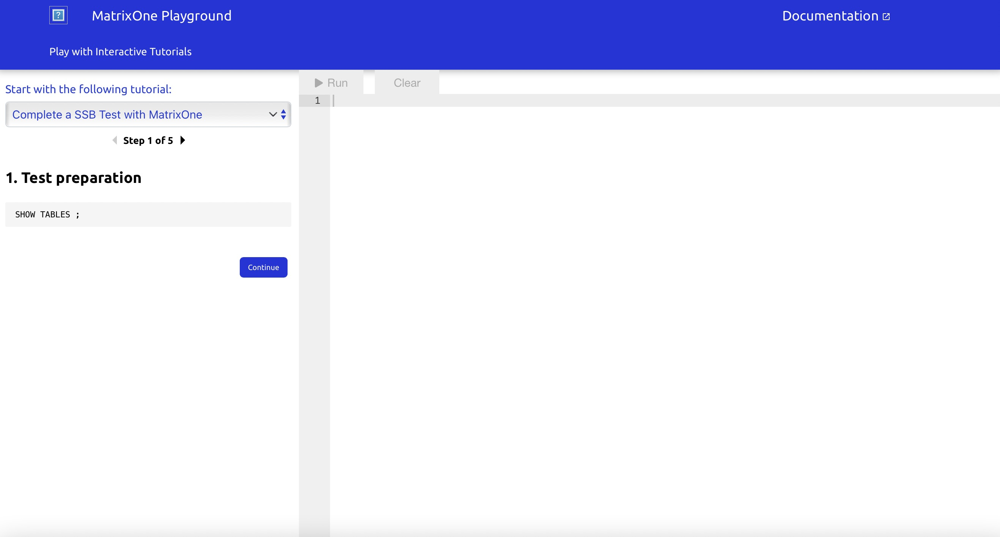

# **Playground**
[MatrixOne Playground](https://playground.matrixorigin.io/?tutorial=SSB-test-with-matrixone&step=1) allow you to try SQL statements and explore features of MatrixOne instantly from your web browser with interactive tutorials.  

* For more guided information about Playground,you can read this page detailly.  
* If you have some questions about SQL,you can also see [SQL Reference](../Reference/SQL-Reference/Data-Definition-Statements/create-database.md).  
* For text and code tutorials,you can see [Tutorial](../Get-Started/Tutorial/SSB-test-with-matrixone.md).

## **Limitations**
There are some limitations in MatixOrigin Playground,You can only operate in read-only mode:
 **DDL** commands are not available:  

* Including *create table* , *drop table* , *truncate* , *update* , *set*  

In addition, some **DML** commands are not available：  

* *insert* , *replace* , *delete* ，*select into*  

The following settings are also enforced:  

* max_result_rows=2000(you can select all columns)

You can only operate in read-only mode in MatixOrigin Playground，so DDL commands and part of DML commands which may change the data are not available.The detail limitations are shown below:

* **DDL** commands are not available:  

```create/drop table , truncate , update , set ,use```  
  
* Part of **DML** commands are not available：  

```insert , replace , delete ，select into ```  

* **commit** is not available

* **call** is not available

* max_result_rows=2000


## **Examples**
Now,You can follow the tutorials to start Playground in the example below.  
[**Click here to turn to Playground**](https://playground.matrixorigin.io/?tutorial=SSB-test-with-matrixone&step=1) 
### **Step1. Test Preperations**


### **Step2. Generate Data**


### **Step3. Treate tables in MatrixOne**


### **Step4. Load data into the created tables**


### **Step5. Run SSB Queries**


## **Learn More**
This page describes the features, limitations, and examples of Playground. For information on other options that are available when trying out MatrixOne, see the following:

* [Install MatrixOne](install-standalone-matrixone.md)
* [What‘s New](../Overview/what's-new.md)